<div align="center">

# 🏭 SimBuilder — Production Line Simulator

### A real-time, drag-and-drop production-line simulator — Spring Boot 4 + WebSocket (STOMP) backend, Angular 17 canvas frontend

*Design a factory floor out of queues and machines, hit **Start**, and watch coloured products flow through multi-threaded machines live — then replay the exact same run from an automatic snapshot.*


-lightgrey)

</div>

---

## 📑 Table of Contents

1. [Overview](#-overview)
2. [Feature Tour](#-feature-tour)
3. [How the Simulation Works](#-how-the-simulation-works)
4. [System Architecture](#-system-architecture)
5. [Tech Stack](#-tech-stack)
6. [Repository & File Structure](#-repository--file-structure)
7. [Backend Deep Dive](#-backend-deep-dive)
8. [Concurrency Model](#-concurrency-model)
9. [Frontend Deep Dive](#-frontend-deep-dive)
10. [Data Model](#-data-model)
11. [API Reference](#-api-reference)
12. [Key Flows (Sequence Diagrams)](#-key-flows-sequence-diagrams)
13. [Design Patterns](#-design-patterns)
14. [OOP Principles & SOLID](#-oop-principles--solid)
15. [Data Structures & Algorithms Used](#-data-structures--algorithms-used)
16. [Security Model](#-security-model)
17. [Getting Started](#-getting-started)
18. [Configuration](#-configuration)
19. [Testing](#-testing)
---

## 🔭 Overview

**SimBuilder** is a discrete-event **production-line simulator** with a visual editor. You build a flow network out of two kinds of nodes — **Queues** (buffers that hold products) and **Machines** (workers that take a product, spend some *service time* on it, and pass it on) — wire them together with arrows, and run the simulation.

Every machine runs on **its own Java thread**. A **product generator** thread creates randomly-coloured products and feeds them into the line. Every state change (a queue grows, a machine starts working, a machine flashes "done") is pushed to the browser over **WebSocket/STOMP**, so the canvas animates in real time.

When a run stops, the backend automatically stores a **snapshot** (Memento pattern) containing the topology, the full stream of generated products and the random seed. One click on **Replay** rebuilds the same line and re-injects the *same* products with the *same* timing.

It is deliberately **database-free**: all state lives in memory inside Spring singletons, which makes the project a compact showcase of **multi-threading, the Observer and Memento patterns, layered architecture and reactive UI state**.

| | Backend | Frontend |
|---|---|---|
| **Language** | Java 17 | TypeScript 5.3 |
| **Framework** | Spring Boot 4.0.1 (Web MVC + WebSocket/STOMP) | Angular 17 (standalone components, lazy-loaded route) |
| **Size** | 32 Java files · ~3,200 lines | 19 TS files · ~2,200 lines (+ ~700 lines of templates) |
| **State** | In-memory — `ConcurrentHashMap`, `LinkedBlockingQueue`, `CopyOnWriteArrayList` | RxJS `BehaviorSubject` / `Subject` inside services |
| **Real-time** | STOMP simple broker (`/topic/*`) | `sockjs-client` + `stompjs`, auto-reconnect |
| **Concurrency** | 1 thread per machine + 1 generator thread | Zone-aware change detection (`NgZone`, `detectChanges`) |
| **Dev port** | `8080` (Spring default) | `4200` (`ng serve`) |

---

## ✨ Feature Tour

| Area | What you can do |
|---|---|
| 🎨 **Visual builder** | Add **Queues** (`Q1`, `Q2`, …) and **Machines** (`M1`, `M2`, …) to an SVG/HTML canvas, drag them anywhere (mouse *and* touch), click to inspect them in a Properties panel |
| 🔗 **Connections** | "Connect" mode: click a source node, then a target node. Only **Q→M** and **M→Q** are legal — enforced on both client and server. Arrows are drawn as curved SVG paths |
| ⚙️ **Machine tuning** | Each machine gets a random service time (1–5 s) and you can change it live in seconds from the Properties panel |
| ▶️ **Run control** | **Start · Pause · Resume · Stop · Clear**, with a status pill (*Running / Paused / Stopped / Replaying*) and a **Live / Offline** WebSocket indicator |
| 🎲 **Product generator** | A generator thread creates a product every 1–3 s with a random colour from an 8-colour palette and drops it into the first queue |
| 📡 **Live animation** | Queues show their products as coloured dots (first 15 + "…"); machines tint themselves with the colour of the product they are processing, pulse while working and flash when done |
| ✅ **Pre-flight validation** | 8 server-side rules (7 errors + 1 cycle warning, mirrored on the client, which adds an orphaned-queue warning) catch isolated nodes, dead-end machines, missing source queues, missing Q→M→Q paths and cycles *before* any thread starts |
| 📸 **Auto-snapshot (Memento)** | Stopping (or clearing) automatically captures topology, queue contents, counters, duration, the generated-product record and the RNG seed |
| 🔁 **Deterministic replay** | Replays the recorded product stream with the original relative timing and the stored seed, then auto-stops after the original duration |
| 📊 **Live statistics** | Products generated, products processed, pause-aware elapsed time (`MM:SS`) and average queue length in the toolbar |
| 🔍 **Canvas navigation** | Zoom 50 %–200 % with the mouse wheel or on-screen buttons, reset view, zoom level readout |
| 🧱 **Safe editing** | Add / connect / delete controls are disabled while a simulation is running |

---

## 🧠 How the Simulation Works

### The model

A production line is a **directed graph that alternates between Queues and Machines**:

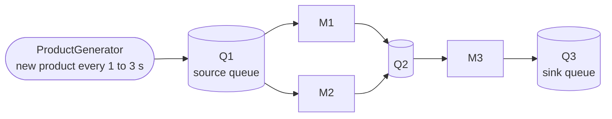

*Products enter at the first queue, are pulled by whichever machine is free, travel to an output queue, and either get pulled by the next machine or accumulate in a terminal queue.*

### The rules of the world

| Rule | Behaviour |
|---|---|
| **Product creation** | `ProductGenerator` sleeps a random 1–3 s, creates a `Product` (UUID + random colour from 8 hex colours) and enqueues it in the **first queue** (the queue with the lexicographically smallest id, normally `Q1`) |
| **Machine pick-up** | A machine only takes work when it is `ready`. If it has several non-empty input queues it picks **one at random** using a seeded `Random` |
| **Service time** | Default random value between **1000 and 4999 ms** per machine, editable through `PUT /api/machine/{id}/servicetime`. The machine "sleeps" in 100 ms chunks so pause/stop are responsive |
| **Visual feedback** | While processing, the machine adopts the **product's colour**. After the service time elapses it emits a `FLASHING` event for 200 ms, then goes back to `idle` and its default blue |
| **Output routing** | If a machine has several output queues, the target is `abs(product.id.hashCode()) % outputQueues.size()` — **deterministic per product**, which is what makes replay reproducible |
| **End of the line** | There is no consumer after the last queue: finished products simply accumulate there |
| **Pause** | Flags flip, the pause clock starts, machines are un-registered as observers and every worker thread idles. Resume re-registers them and un-pauses the clock |
| **Stop** | Flags flip, generator is interrupted, machine threads are joined (≤ 5 s each, then interrupted), machines are reset to idle and a **snapshot is taken automatically** |

### Simulation lifecycle

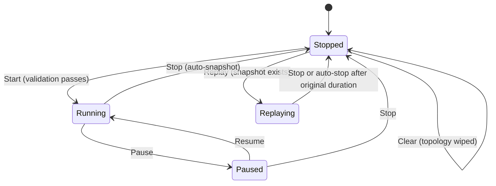

---

## 🏗️ System Architecture

### High-level view

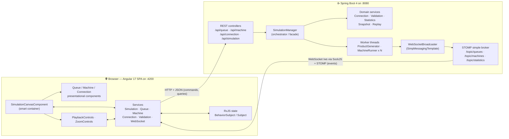

The system uses a **CQRS-flavoured split**: the browser sends **commands and queries over REST**, while **state changes flow back as events over WebSocket**. The frontend never polls for queue or machine state — only for statistics and snapshot availability.

### Backend layering

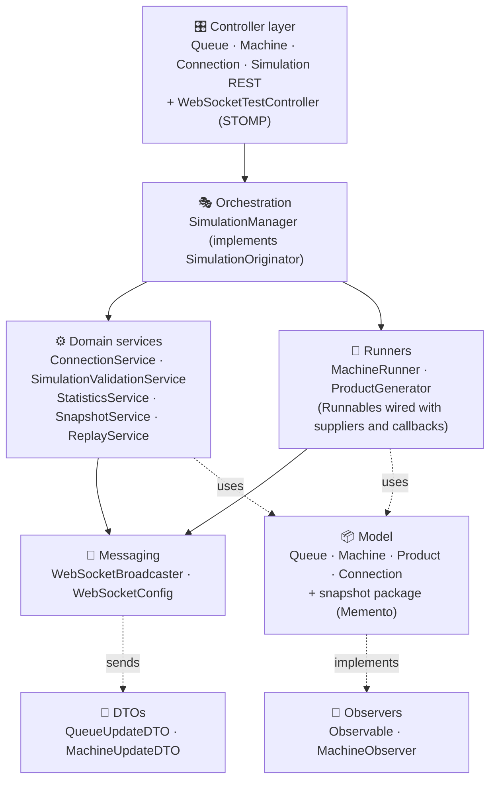

### Frontend layering

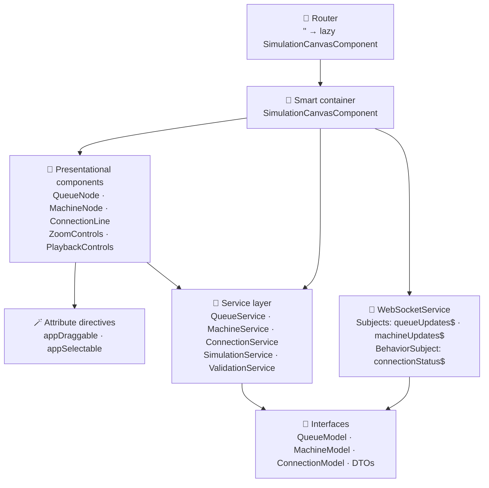

---

## 🧰 Tech Stack

### Backend

| Technology | Version | Purpose |
|---|---|---|
| **Java** | 17 | Language / runtime (`java.version` in `pom.xml`) |
| **Spring Boot** (`spring-boot-starter-parent`) | 4.0.1 | Application framework, auto-configuration, DI container |
| `spring-boot-starter-webmvc` | managed | REST controllers, JSON (Jackson) serialisation, CORS annotations |
| `spring-boot-starter-websocket` | managed | STOMP over WebSocket + SockJS fallback, `SimpMessagingTemplate`, in-memory simple broker |
| **Lombok** | managed | `@Data`, `@Getter`, `@NoArgsConstructor`, `@AllArgsConstructor` boilerplate removal (annotation processor configured in `maven-compiler-plugin`, excluded from the fat jar) |
| `spring-boot-devtools` | managed | Hot restart during development |
| **Jackson** annotations | managed | `@JsonIgnore` hides thread-unsafe / cyclic fields (`BlockingQueue`, observer lists, queue references) from REST responses |
| **Maven Wrapper** | 3.3.4 → Maven 3.9.12 | Reproducible builds with no local Maven (`mvnw` / `mvnw.cmd`) |
| `spring-boot-starter-webmvc-test`, `spring-boot-starter-websocket-test` | managed | Test scaffolding (JUnit 5) |

> There is **no database, no ORM and no security starter** — the whole simulation lives in the JVM heap.

### Frontend

| Technology | Version | Purpose |
|---|---|---|
| **Angular** | ^17.2 | SPA framework — **standalone components**, no NgModules, `application` builder |
| **TypeScript** | ~5.3.2 | Strict typing (`strict`, `strictTemplates`, `noImplicitReturns`, …) |
| **RxJS** | ~7.8 | `BehaviorSubject`/`Subject` state streams, `forkJoin`, `interval` + `switchMap` + `takeWhile` for replay polling |
| **Zone.js** | ~0.14 | Change detection (WebSocket callbacks are re-entered with `NgZone.run`) |
| **sockjs-client** | ^1.6.1 | WebSocket transport with fallbacks |
| **stompjs** | ^2.3.3 | STOMP client actually used by `WebSocketService` |
| **Tailwind CSS** | ^3.4 | Utility-first styling (custom colours `primary #2094f3`, `primary-dark`, `success`, `background-light`) — picked up automatically by the Angular CLI from `tailwind.config.js` |
| **PostCSS + Autoprefixer** | ^8.5 / ^10.4 | CSS pipeline |
| **Google Fonts** | — | *Inter* (UI) and *Material Symbols Outlined* (icons), linked from `index.html` |
| **Karma + Jasmine** | ~6.4 / ~5.1 | Unit-test runner |
| **Angular CLI** | ^17.2.3 | Build, serve, test |

> 📝 `package.json` also declares **`konva`** (canvas library) and **`@stomp/stompjs`**. Neither is imported anywhere in `src/` — the canvas is built with plain HTML/SVG + Tailwind, and the STOMP client in use is the older `stompjs`. They are candidates for removal (see [Roadmap](#-known-limitations--roadmap)).

---

## 📂 Repository & File Structure

```text
Production-Line-Simulator-master/
├── .gitignore
│
├── backend-app/                                   ☕ Spring Boot application
│   ├── README.md                                  one-line placeholder
│   └── producuctionLine/                          Maven project root
│       ├── pom.xml                                Java 17 · Boot 4.0.1 · web + websocket + lombok
│       ├── mvnw / mvnw.cmd                        Maven wrapper scripts
│       ├── .mvn/wrapper/maven-wrapper.properties  Maven 3.9.12
│       ├── test-websocket.html                    manual SockJS/STOMP ping page (legacy helper)
│       └── src/
│           ├── main/
│           │   ├── resources/application.properties        (only sets the app name)
│           │   └── java/com/example/producuctionLine/
│           │       ├── ProducuctionLineApplication.java    @SpringBootApplication entry point
│           │       ├── config/
│           │       │   └── WebSocketConfig.java            STOMP endpoint /ws, broker /topic, prefix /app
│           │       ├── controller/
│           │       │   ├── QueueController.java            /api/queue
│           │       │   ├── MachineController.java          /api/machine
│           │       │   ├── ConnectionController.java       /api/connection
│           │       │   ├── SimulationController.java       /api/simulation (lifecycle, snapshot, replay)
│           │       │   └── WebSocketTestController.java    STOMP @MessageMapping test hooks
│           │       ├── service/
│           │       │   ├── SimulationManager.java          🧠 orchestrator: nodes, threads, lifecycle
│           │       │   ├── ConnectionService.java          graph edges + Q/M wiring
│           │       │   ├── SimulationValidationService.java pre-flight rules
│           │       │   ├── StatisticsService.java          counters + pause-aware clock
│           │       │   ├── SnapshotService.java            builds / restores snapshots
│           │       │   ├── ReplayService.java              replay-mode state + recorded stream
│           │       │   └── WebSocketBroadcaster.java       SimpMessagingTemplate wrapper
│           │       ├── runner/
│           │       │   ├── MachineRunner.java              one thread per machine
│           │       │   └── ProductGenerator.java           producer thread (normal + replay mode)
│           │       ├── model/
│           │       │   ├── Queue.java                      Subject in the Observer pattern
│           │       │   ├── Machine.java                    Observer + node state
│           │       │   ├── Product.java                    UUID + random colour
│           │       │   ├── Connection.java                 directed edge  (from → to)
│           │       │   └── snapshot/                       🧾 Memento package
│           │       │       ├── SimulationSnapshot.java     the Memento
│           │       │       ├── SimulationOriginator.java   Originator interface
│           │       │       ├── SimulationCaretaker.java    history keeper
│           │       │       └── Queue/Machine/Product/ConnectionSnapshot.java
│           │       ├── Obserevers/                         Observer interfaces (sic)
│           │       │   ├── Observable.java
│           │       │   └── MachineObserver.java
│           │       └── dto/
│           │           ├── QueueUpdateDTO.java             (+ nested ProductDTO)
│           │           └── MachineUpdateDTO.java
│           └── test/java/.../ProducuctionLineApplicationTests.java   contextLoads smoke test
│
└── frontend-app/                                  🅰️ Angular 17 application
    ├── angular.json                               build / serve / test targets, budgets
    ├── package.json  package-lock.json
    ├── tailwind.config.js                         custom palette + Inter font
    ├── tsconfig.json  tsconfig.app.json  tsconfig.spec.json
    ├── .editorconfig  .vscode/                    editor settings, launch + tasks
    ├── simbuilder-frontend/                       (empty folder)
    └── src/
        ├── index.html  main.ts  polyfills.ts  styles.css  favicon.ico
        ├── app/
        │   ├── app.component.ts                   root: <router-outlet> + opens the WebSocket
        │   ├── app.config.ts                      providers: router + HttpClient
        │   └── app.routes.ts                      '' → lazy SimulationCanvasComponent
        ├── components/
        │   ├── canvas/
        │   │   ├── simulation-canvas.component.ts|html|css   🧠 smart container (toolbar, canvas, side panel)
        │   │   ├── queue-node/                    queue card (coloured product dots, size)
        │   │   ├── machine-node/                  machine card (status, tint, service time)
        │   │   └── connection-line/               SVG arrows (inline template)
        │   ├── playback-controls/                 start/pause/stop/replay/clear + stats + validation popup
        │   └── zoom-controls/                     +, −, reset buttons (inline template)
        ├── directives/
        │   ├── draggable.directive.ts             mouse + touch dragging with zoom compensation
        │   └── selectable.directive.ts            toggles a `selected` class on click
        ├── services/
        │   ├── SimulationService.ts               lifecycle API + reactive run state + replay polling
        │   ├── queue.service.ts                   /api/queue client + response adapter
        │   ├── machine.service.ts                 /api/machine client
        │   ├── connection.service.ts              /api/connection client + Q/M rule check
        │   ├── validation.service.ts              client-side pre-flight validation
        │   └── websocket.service.ts               SockJS + STOMP client, RxJS streams
        └── assets/.gitkeep
```

---

## ☕ Backend Deep Dive

Base package: `com.example.producuctionLine`

### Controllers (`controller/`)

| Controller | Base path | Responsibility |
|---|---|---|
| `QueueController` | `/api/queue` | Create, list, fetch, move and delete queues |
| `MachineController` | `/api/machine` | Create, list, fetch, move, change service time, read status, delete machines |
| `ConnectionController` | `/api/connection` | Create a connection (validated) and list all connections |
| `SimulationController` | `/api/simulation` | `start · stop · pause · resume · clear`, `status`/`statistics`, `snapshot` (save/check), `replay`, `replay/status` |
| `WebSocketTestController` | STOMP `/app/test/*` | `@MessageMapping` hooks that push a fake queue/machine update (debug aid — see [limitations](#-known-limitations--roadmap)) |

All REST controllers are thin: they receive a `SimulationManager` by **constructor injection** and delegate to it. `SimulationController` maps `IllegalStateException` to `400` (anything else to `500`), `ConnectionController` maps any failure to `400`, and both return an `{ "error": … }` body; `QueueController` / `MachineController` return `404` for unknown ids where relevant. Every controller carries `@CrossOrigin(origins = "http://localhost:4200")`.

### The orchestrator — `SimulationManager`

The heart of the backend. It is a Spring `@Service` singleton that **owns the live world** and acts as a **facade** over five collaborating services.

| Responsibility | Details |
|---|---|
| **Node registries** | `Map<String, Queue> queues` and `Map<String, Machine> machines` (both `ConcurrentHashMap`); id counters generate `Q1, Q2…` / `M1, M2…` |
| **Edge management** | Delegates to `ConnectionService` (create / delete / clear / lookup) |
| **Lifecycle** | `startSimulation`, `stopSimulation`, `pauseSimulation`, `resumeSimulation`, `clearSimulation` — all `synchronized`; `isRunning` / `isPaused` are `volatile` |
| **Thread management** | Creates one `Thread` per machine plus the generator thread; joins and interrupts them on stop |
| **Factory methods** | `createMachineRunner(machine)` and `createProductGenerator()` wire runners with lambdas/method-references |
| **Snapshots** | Implements `SimulationOriginator` (`createSnapshot`, `restoreFromSnapshot`) and delegates the heavy lifting to `SnapshotService` |
| **Replay** | Delegates to `ReplayService` (`setupReplayMode`, `getReplayStatus`, `disableReplayMode`) |
| **Statistics** | Aggregates a `Map<String,Object>` (running, paused, generated, processed, duration, avg queue length, counts) |

### Services (`service/`)

| Service | Responsibility |
|---|---|
| `ConnectionService` | Keeps a `CopyOnWriteArrayList<Connection>`. On `createConnection` it checks that both endpoints exist, that the node types **alternate** (`Q→M` or `M→Q`, derived from the first letter of the id), that the edge is not a duplicate — then **wires the objects**: `machine.addInputQueue(queue)` + `queue.registerObserver(machine)` for Q→M, `machine.addOutputQueue(queue)` for M→Q. Also provides `deleteConnection`, `removeConnectionsForNode`, `hasValidPath` |
| `SimulationValidationService` | Pre-flight checks (see [Validation rules](#validation-rules) below). Returns a `ValidationResult` with `errors` and `warnings` |
| `StatisticsService` | Generated / processed counters, simulation start time, **pause-aware duration** (`total elapsed − total paused − current pause`), average queue length |
| `SnapshotService` | **Builds** a `SimulationSnapshot` from the live maps and **restores** the world from one (recreates queues with products, machines, connections, and re-wires observers). Owns the `SimulationCaretaker` |
| `ReplayService` | Holds replay-mode flag, the product list to replay, the replay index and the list of products *recorded* during the current normal run |
| `WebSocketBroadcaster` | The only class that talks to `SimpMessagingTemplate`. Converts a `Queue` into a `QueueUpdateDTO` (with every product's id/colour) and sends to `/topic/queues`; sends `MachineUpdateDTO` to `/topic/machines` and a stats map to `/topic/statistics` |

### Runners (`runner/`)

Both are plain `Runnable`s that **do not know `SimulationManager`**. Everything they need is injected as small functional interfaces (`BooleanSupplier`, `Supplier`, `Runnable`), which keeps them decoupled and testable.

| Runner | What it does |
|---|---|
| `MachineRunner` | The per-machine loop (50 ms tick): wait while paused → if the machine is ready and some input queue is non-empty, pick one at random, `dequeue()`, and `processProduct` (sleep in 100 ms chunks, flash, route to an output queue, bump statistics, broadcast). Cleanly returns the product to an input queue if the run is stopped/paused mid-flight |
| `ProductGenerator` | **Normal mode:** sleep 1–3 s, create a product, **record** it (`id`, `colour`, relative time) for later replay, enqueue in the first queue, broadcast. **Replay mode:** read the recorded list, sleep for the *delta* between consecutive recorded times, re-create the product with the recorded id and colour |

### Models (`model/`)

| Class | Role |
|---|---|
| `Queue` | Holds a `LinkedBlockingQueue<Product>`; **Subject** of the Observer pattern (`registerObserver / unregisterObserver / notifyObservers`); `enqueue`/`dequeue` are `synchronized`; `getProductList()` returns a defensive copy |
| `Machine` | Node state (`name`, `status`, `ready`, `color`, `defaultColor`, `serviceTime`, position, `currentProduct`, `inputQueues`, `outputQueues`); implements `MachineObserver` (and `Runnable`, though the active loop lives in `MachineRunner`) |
| `Product` | `id` (UUID), `color` (one of 8 hex colours), `createdAt` |
| `Connection` | Directed edge `fromId → toId` with id `"fromId-toId"` |

### DTOs (`dto/`)

| DTO | Payload |
|---|---|
| `QueueUpdateDTO` | `queueId`, `currentSize`, `products[]` (nested `ProductDTO { id, color, createdAt }`) |
| `MachineUpdateDTO` | `machineId`, `status` (`processing` · `FLASHING` · `idle`), `productColor` |

### Validation rules

`SimulationManager.startSimulation()` runs the validator **before any thread starts**; any error aborts with a `400`.

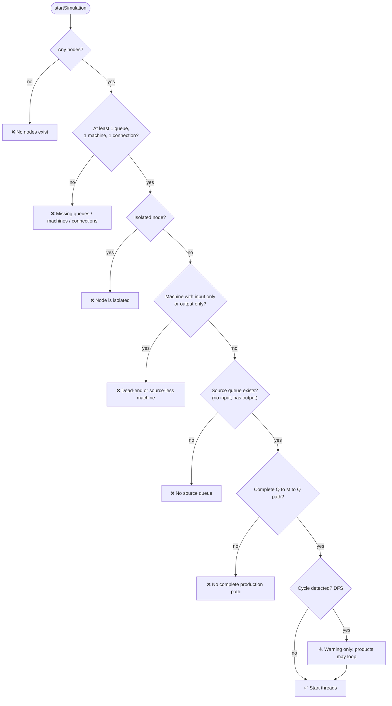

| # | Rule | Severity | Where |
|---|---|---|---|
| 1 | At least one node exists | error | client + server |
| 2 | At least 1 queue, 1 machine and 1 connection | error | client + server |
| 3 | No isolated node (no input and no output) | error | client + server |
| 4 | No machine with input but no output (stuck products) / output but no input (starved) | error | client + server |
| 5 | At least one **source queue** (no input, has output) | error | client + server |
| 6 | At least one complete **Q→M→Q** path | error | client + server |
| 7 | Every connection alternates Q/M | error | client + server |
| 8 | **Cycles** (DFS with a recursion stack) | warning | client + server |
| 9 | Queues with **no reachable machine** (BFS) | warning | client only |

On the client, errors open a **validation popup**; warnings trigger a `confirm()` so the user can proceed anyway.

### Observer wiring

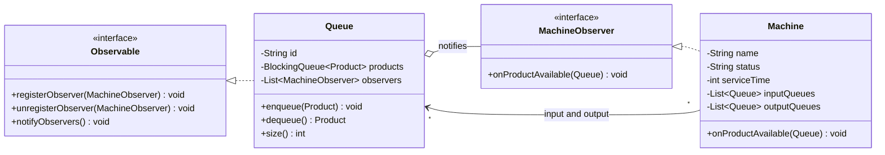

> 🔎 **Honest note:** `Queue.enqueue()` fires `notifyObservers()` and `Machine.onProductAvailable()` currently just logs. The *actual* work hand-off happens in `MachineRunner`, which polls its input queues every 50 ms. The Observer pair is the architectural hook (and `pause` / `resume` / `delete` correctly register and unregister observers), but the machine threads are poll-driven.

---

## 🧵 Concurrency Model

This project is first and foremost a **multi-threaded** simulation, so it is worth understanding who runs where.

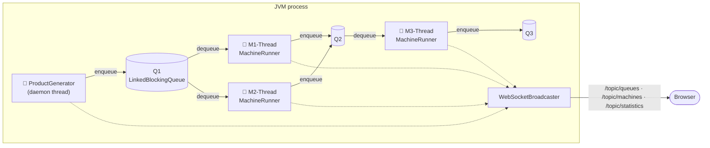

This is a classic **Producer → bounded-by-nothing buffer → Consumer** network: the generator is the producer, every `Queue` is a thread-safe buffer, and every machine is a consumer *and* a producer for the next queue.

### Threads

| Thread | Created by | Notes |
|---|---|---|
| **HTTP threads** | Embedded servlet container | Serve REST calls; run `start/stop/pause/resume/clear` and node CRUD |
| **`<machine>-Thread`** (e.g. `M1-Thread`) | `SimulationManager.startSimulation()` (and `addMachine()` if a machine is added mid-run) | One per machine, runs a `MachineRunner` until `isRunning` becomes `false` |
| **`ProductGenerator`** | `SimulationManager.startSimulation()` | Daemon thread; produces new products (or replays recorded ones) |
| **`Replay-AutoStop`** | `SimulationController.replay()` | Short-lived thread that sleeps for the original run duration, then stops the simulation |
| **Messaging threads** | Spring's STOMP infrastructure | Deliver `convertAndSend` payloads to subscribers |

### Synchronisation toolbox

| Mechanism | Where | Why |
|---|---|---|
| `volatile boolean isRunning / isPaused` | `SimulationManager` | Lifecycle flags are read by every worker through `BooleanSupplier` lambdas — `volatile` guarantees visibility |
| `synchronized` methods | `SimulationManager` lifecycle + snapshot methods, `Queue.enqueue/dequeue`, `StatisticsService.increment*` | Mutual exclusion around compound state changes |
| `LinkedBlockingQueue<Product>` | `Queue.products` | Thread-safe FIFO buffer |
| `CopyOnWriteArrayList` | queue observers, machine input/output queue lists, connection list | Cheap lock-free iteration while the topology is rewired |
| `ConcurrentHashMap` | `queues`, `machines`, `machineThreads` | Concurrent registries |
| `pauseLock` object | `MachineRunner` ↔ `SimulationManager` | Re-checks pause/stop *under the lock* right before taking a product, closing a race window |
| **Cooperative cancellation** | `Thread.sleep` in 50–100 ms slices + flag checks | Pause/stop take effect within ~100 ms instead of waiting for a whole service time |
| `Thread.join(timeout)` + `interrupt()` | `stopSimulation()` | Waits for the generator (2 s) and each machine (5 s) so in-flight products land in a queue **before** the snapshot is taken |

### The machine loop

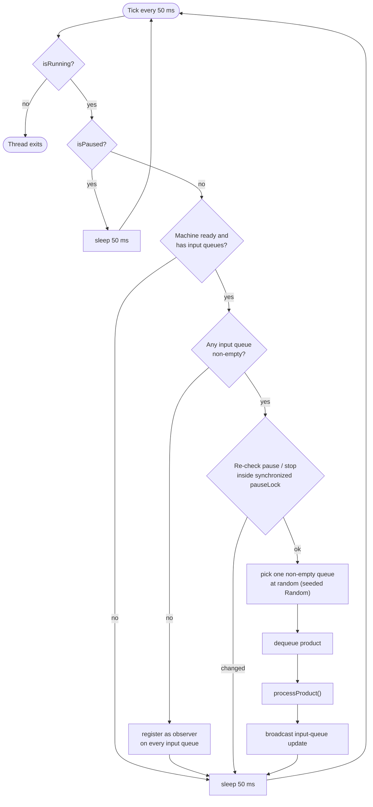

### Machine status

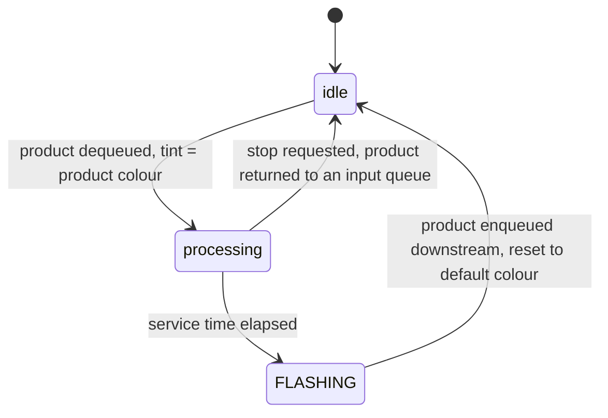

---

## 🅰️ Frontend Deep Dive

### Bootstrap & routing

`main.ts` → `bootstrapApplication(AppComponent, appConfig)` with `provideRouter(routes)` and `provideHttpClient()`. There are **no NgModules** — every component and directive is `standalone: true`.

| Path | Component | Loading |
|---|---|---|
| `''` | `SimulationCanvasComponent` | **Lazy** via `loadComponent: () => import(...)` |

`AppComponent` injects `WebSocketService` and calls `connect()` in its constructor, so the live connection exists for the whole lifetime of the app.

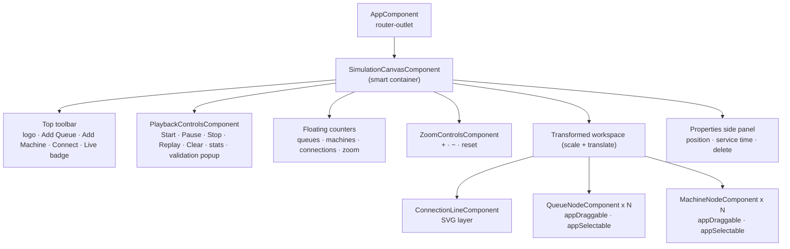

### Components

| Component | Role |
|---|---|
| `AppComponent` | Root shell with a `<router-outlet>`; opens the WebSocket connection |
| `SimulationCanvasComponent` | **Smart container.** Owns `queues[]`, `machines[]`, `connections[]`, run/connection state, zoom/pan state and the selected node. Loads data with `forkJoin(queues, machines)` then connections, creates/moves/deletes nodes through the services, runs the connect-mode state machine, and subscribes to WebSocket streams to mutate the models |
| `QueueNodeComponent` | Presentational card: id, `QUEUE` badge, up to **15 coloured dots** (one per product, "…" for the rest) and a large size counter. Emits `moved` |
| `MachineNodeComponent` | Presentational card: id, status dot, status text (`idle` / `processing` / `Done!`), service time, product-colour tint (hex colour + alpha suffix), bounce/pulse animations. Emits `moved` |
| `ConnectionLineComponent` | One SVG layer drawing every edge as a quadratic Bézier (`Q` + `T`) with an arrowhead `marker` |
| `PlaybackControlsComponent` | Start / Pause-Resume / Stop / Replay / Clear, status pill, statistics strip, validation popup. Receives `queues`, `machines`, `connections` as `@Input`s to validate locally before calling the API |
| `ZoomControlsComponent` | Three icon buttons emitting `zoomIn`, `zoomOut`, `resetZoom` |

### Directives

| Directive | Behaviour |
|---|---|
| `appDraggable` | Mouse **and** touch dragging. Records the start point, applies `(Δ / canvasScale)` so dragging stays accurate while zoomed, writes `left`/`top` directly, and emits `dragEnd({x, y})` on release. Cleans up document-level listeners in `ngOnDestroy` |
| `appSelectable` | Adds a `selected` class on click via `@HostBinding` |

### Services

| Service | Responsibility |
|---|---|
| `SimulationService` | Lifecycle API client (`start/stop/pause/resume/clear/replay/snapshot/status/statistics`) and the **reactive run state**: `isRunning$`, `isPaused$`, `isReplaying$`, `statistics$` (all `BehaviorSubject`-backed). Starts replay-status polling (`interval(1000)` → `switchMap` → `takeWhile`) |
| `QueueService` | CRUD against `/api/queue` and an **adapter** from the backend shape (`currentSize`) to the UI model (`size`, `productList`) |
| `MachineService` | CRUD against `/api/machine`, position/service-time updates, status |
| `ConnectionService` | `/api/connection` client + `validateConnection()` (Q→M or M→Q) |
| `ValidationService` | Pure client-side validation mirroring the server rules, plus the extra orphaned-queue warning (BFS) and a printable summary |
| `WebSocketService` | Creates the `SockJS` socket + `Stomp` client, subscribes to `/topic/queues` and `/topic/machines`, exposes `queueUpdates$`, `machineUpdates$` (`Subject`) and `connectionStatus$` (`BehaviorSubject<boolean>`), wraps every emission in `NgZone.run`, and **auto-reconnects after 5 s** on error |

### Real-time update path

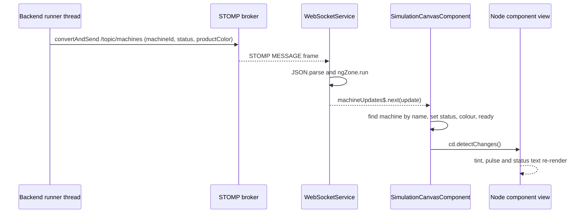

### Canvas interactions

| Interaction | Implementation |
|---|---|
| **Add node** | Random position (queues around x 100–500, machines around x 300–700, y 100–400) → `POST` → push the returned model into the local array |
| **Drag node** | `appDraggable` emits final `{x, y}` → component updates the model, sends `PUT …/position`, recomputes connection endpoints |
| **Connect** | Connect-mode state machine (below). One connection per click of **Connect** — the mode switches itself off after a success |
| **Select / inspect** | Click a node → `selectedNodeDetails` → Properties panel (position, service time editor for machines, delete) |
| **Zoom** | Wheel (`±0.1`, clamped to `0.5–2`) or buttons; applied as `transform: scale() translate()` on the workspace |
| **Disable while running** | Add / Connect / Delete buttons are bound to `[disabled]="isRunning"` |

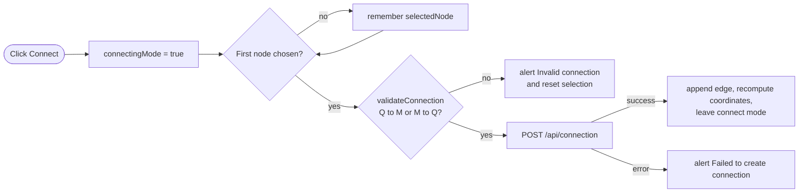

### Styling

Tailwind utilities do almost everything (layout, rings for selection, `animate-pulse` / `animate-ping` / `animate-bounce` for machine states, a dotted `radial-gradient` grid background). Icons come from **Material Symbols**. A product colour tints a machine by appending an alpha suffix to the hex value (`+ '15'`, `'25'`, `'40'`). `angular.json` sets build budgets: initial bundle warns at **500 kB** and errors at **1 MB**; per-component styles warn at **2 kB** and error at **4 kB**.

---

## 💾 Data Model

There is **no database** — these are in-memory objects. Persisted-looking structures exist only inside snapshots.

### Domain model

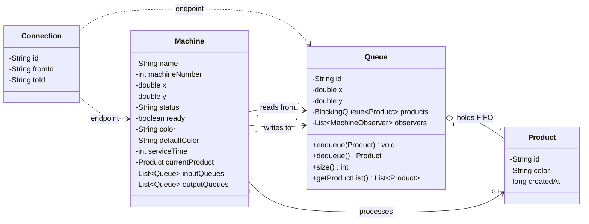

> `@JsonIgnore` hides `Queue.products`, `Queue.observers`, `Machine.inputQueues`, `Machine.outputQueues`, `Machine.currentProduct` and the thread fields from REST responses (they are thread-unsafe or would create cycles). `Queue` exposes `currentSize` and `productList` through getters instead.

### Snapshot structure (Memento)

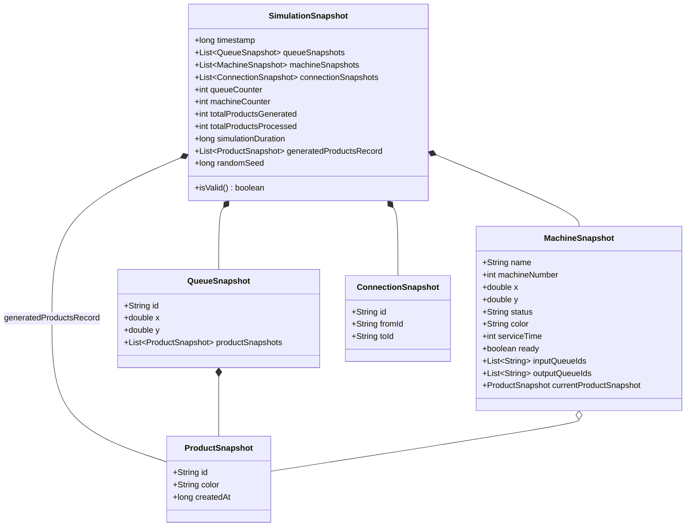

Snapshots store **ids instead of object references** (`inputQueueIds`, `outputQueueIds`), so the graph can be rebuilt from scratch — `SnapshotService.restoreFromSnapshot` recreates queues, then machines, then walks the connection list to re-wire `addInputQueue` / `addOutputQueue` and re-register observers.

> ⚠️ `ProductSnapshot.createdAt` has **two meanings**: epoch-milliseconds when it describes a product sitting in a queue or machine, and *milliseconds since the run started* when it lives in `generatedProductsRecord` (that is how the replay computes inter-arrival delays).

### Id generation

| Entity | Rule |
|---|---|
| Queue | `"Q" + ++queueCounter` → `Q1`, `Q2`, … |
| Machine | `"M" + ++machineCounter` → `M1`, `M2`, … (`name` is the id used everywhere on the wire; `machineNumber` is the numeric part) |
| Connection | `fromId + "-" + toId` |
| Product | `UUID.randomUUID()` |
| Counters | Reset to `0` on **Clear**, restored from the snapshot on **Replay** |

### Sample payloads

**`GET /api/queue` (one element, key fields)**

```json
{
  "id": "Q1",
  "x": 220.0,
  "y": 180.0,
  "currentSize": 2,
  "productList": [
    { "id": "5c1a…", "color": "#22c55e", "createdAt": 1767456000123 },
    { "id": "9f02…", "color": "#8b5cf6", "createdAt": 1767456002410 }
  ]
}
```

**WebSocket `/topic/queues` → `QueueUpdateDTO`**

```json
{
  "queueId": "Q2",
  "currentSize": 1,
  "products": [ { "id": "5c1a…", "color": "#22c55e", "createdAt": 1767456000123 } ]
}
```

**WebSocket `/topic/machines` → `MachineUpdateDTO`**

```json
{ "machineId": "M1", "status": "processing", "productColor": "#22c55e" }
```

---

## 🌐 API Reference

The backend exposes **REST** for commands/queries and **STOMP over WebSocket** for events. There is no authentication. Machine ids in URLs are the machine **name** (`M1`, `M2`, …).

### Queues — `/api/queue`

| Method | Path | Body | Response |
|---|---|---|---|
| POST | `/` | `{ "x": 100, "y": 200 }` (both default to `100`) | `200` the new queue |
| GET | `/` | — | `200` all queues |
| GET | `/{id}` | — | `200` queue · `404` |
| PUT | `/{id}/position` | `{ "x": 150, "y": 250 }` | `200` queue · `404` |
| DELETE | `/{id}` | — | `200 { "message", "id" }` — also removes every connection touching the queue and cleans machine references |

### Machines — `/api/machine`

| Method | Path | Body | Response |
|---|---|---|---|
| POST | `/` | `{ "x", "y" }` | `200` machine (random service time 1–4.99 s). If a run is active its thread starts immediately |
| GET | `/` | — | `200` all machines |
| GET | `/{id}` | — | `200` machine · `404` |
| PUT | `/{id}/position` | `{ "x", "y" }` | `200` · `404` |
| PUT | `/{id}/servicetime` | `{ "serviceTime": 3000 }` (ms) | `200` machine · `404` |
| GET | `/{id}/status` | — | `200 { id, status, isReady, color, serviceTime, hasCurrentProduct }` |
| DELETE | `/{id}` | — | `200 { "message", "id" }` — interrupts its thread, drops its connections, unregisters it from input queues · `404` |

### Connections — `/api/connection`

| Method | Path | Body | Response |
|---|---|---|---|
| POST | `/` | `{ "fromId": "Q1", "toId": "M1" }` | `200 { "message", "connection" }` · `400 { "error" }` if a node is missing, types don't alternate, or the edge exists |
| GET | `/` | — | `200` all connections |

### Simulation — `/api/simulation`

| Method | Path | Description | Responses |
|---|---|---|---|
| POST | `/start` | Disables replay mode, validates, clears queues, seeds the RNG, starts all threads | `200 { status:"started", isRunning:true }` · `400 { error }` with the joined validation messages |
| POST | `/stop` | Stops threads, resets machines, **auto-saves a snapshot** | `200 { status:"stopped" }` |
| POST | `/pause` | Freezes the run (and the pause clock) | `200` · `400` if not running / already paused |
| POST | `/resume` | Continues the run | `200` · `400` if not running / not paused |
| POST | `/clear` | Stops if running, auto-snapshots *if none exists yet*, wipes queues, machines, connections, counters | `200 { status:"cleared" }` |
| GET | `/status` · `/statistics` | Same payload: `isRunning, isPaused, totalGenerated, totalProcessed, duration (ms), avgQueueLength, queueCount, machineCount, connectionCount` | `200` |
| POST | `/snapshot` | Manually save a snapshot | `200 { status:"saved", timestamp, queues, machines, connections }` |
| GET | `/snapshot` | Is a replay possible? | `200 { hasSnapshot, timestamp, queues, machines, connections }` or `{ hasSnapshot:false }` |
| POST | `/replay` | Restore last snapshot → enable replay mode → start → schedule auto-stop | `200 { status:"replaying", duration, queues, machines }` · `400` if no snapshot |
| GET | `/replay/status` | Replay progress | `200 { isReplayMode, isRunning, totalProducts, replayIndex, productsReplayed, productsRemaining }` |

### WebSocket (STOMP)

| Item | Value |
|---|---|
| **Endpoint** | `http://localhost:8080/ws` (SockJS; allowed origin patterns `*`) |
| **Broker prefix** | `/topic` (in-memory simple broker) |
| **Application prefix** | `/app` |

| Direction | Destination | Payload | Sent when |
|---|---|---|---|
| Server → client | `/topic/queues` | `QueueUpdateDTO { queueId, currentSize, products[{id,color,createdAt}] }` | A product is enqueued/dequeued, or replay clears the canvas |
| Server → client | `/topic/machines` | `MachineUpdateDTO { machineId, status, productColor }` — `status` ∈ `processing`, `FLASHING`, `idle` | A machine starts, finishes (flash) or resets |
| Server → client | `/topic/statistics` | Same map as `/api/simulation/status` | After each generated/processed product (**the bundled frontend does not subscribe — it polls instead**) |
| Client → server | `/app/test/queue`, `/app/test/machine` | empty | Debug hooks that broadcast fake updates |

---

## 🔄 Key Flows (Sequence Diagrams)

### 1. Building a line

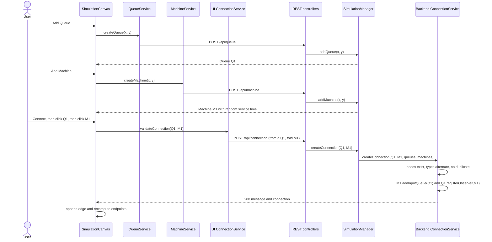

### 2. Start with two-tier validation

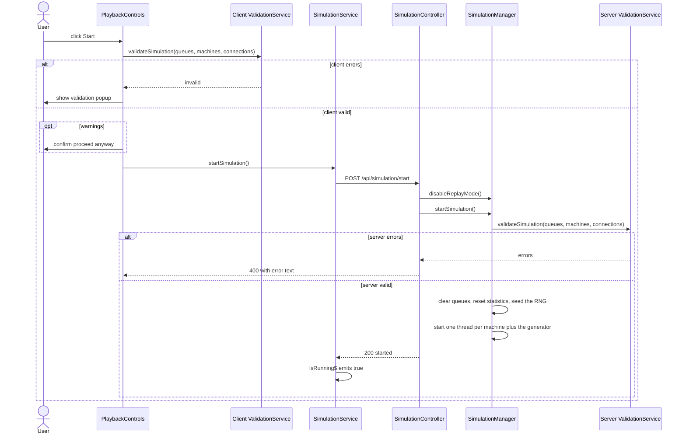

### 3. Life of a product

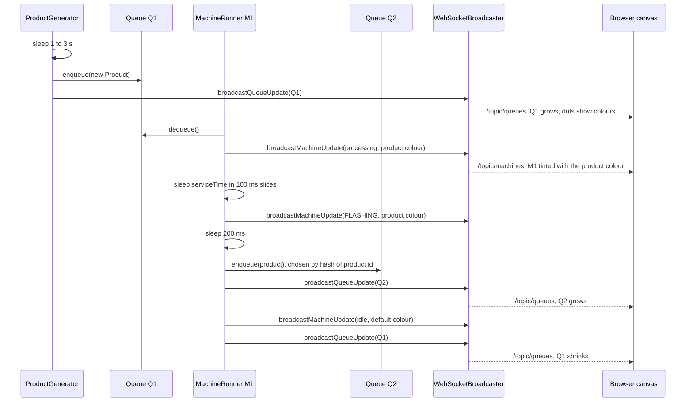

### 4. Pause & resume

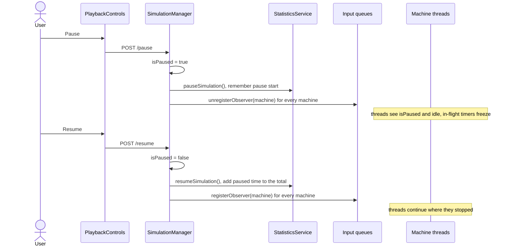

### 5. Stop & automatic snapshot

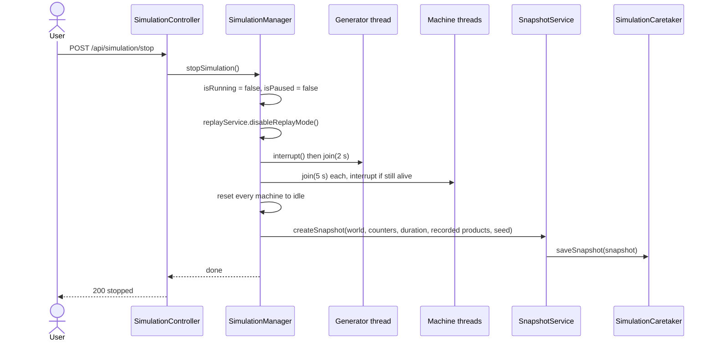

### 6. Replay

```mermaid
sequenceDiagram
    actor U as User
    participant PC as PlaybackControls
    participant SC as SimulationController
    participant SM as SimulationManager
    participant SS as SnapshotService
    participant RS as ReplayService
    participant PG as ProductGenerator
    U->>PC: click Replay
    PC->>SC: POST /api/simulation/replay
    SC->>SM: getLastSnapshot()
    SC->>SM: restoreFromSnapshot(snapshot)
    SM->>SS: restoreFromSnapshot(...)
    SS-->>SM: RestoreResult with counters and seed
    SC->>SM: setupReplayMode(snapshot)
    SM->>RS: setupReplayMode(...) clears queues, resets machines, broadcasts
    SC->>SM: startSimulation()
    Note over SM: validation runs again, RNG is seeded with the stored seed
    SM->>PG: start generator thread in replay mode
    loop for each recorded product
        PG->>PG: sleep for the gap between recorded times
        PG->>PG: create product with the recorded id and colour
        PG->>PG: enqueue in the first queue and broadcast
    end
    SC->>SC: start Replay-AutoStop thread, sleeps for the original duration
    SC-->>PC: 200 replaying
    PC->>PC: poll /replay/status every second
```

---

## 🧩 Design Patterns

```mermaid
mindmap
  root((SimBuilder))
    Behavioural
      Observer
        Queue notifies Machine
        RxJS Subjects
      Memento
        SimulationSnapshot
        Originator and Caretaker
      Record and Replay
      Producer Consumer
    Creational
      Factory Method
      Singleton
      Dependency Injection
    Structural
      Facade
        SimulationManager
        Angular services
      Adapter
        QueueService mapping
      DTO
      Decorator like directives
    Architectural
      Layered
      Publish Subscribe
      Smart and dumb components
```

| # | Pattern | Where | Why it is used |
|---|---|---|---|
| 1 | **Observer** | `Observable` (`Queue` as Subject) and `MachineObserver` (`Machine`); registered on connect, un-registered on pause / delete / disconnect | A queue announces "a product is available" without knowing who consumes it; consumers can come and go. *(Today the callback only logs — see the note in [Observer wiring](#observer-wiring).)* |
| 2 | **Memento** | `SimulationSnapshot` + `QueueSnapshot` / `MachineSnapshot` / `ConnectionSnapshot` / `ProductSnapshot`; **Originator** `SimulationOriginator` ← `SimulationManager`; **Caretaker** `SimulationCaretaker` | Capture and restore the entire world without exposing internals; powers the replay feature. The caretaker keeps a history list + index and discards the "future" when a new snapshot is saved, so `undo()` / `redo()` / `getSnapshot(i)` are already supported (the REST API currently only uses save / check / replay-last) |
| 3 | **Facade / Orchestrator** | `SimulationManager` | One entry point hides `ConnectionService`, `StatisticsService`, `SnapshotService`, `ReplayService`, `SimulationValidationService`, `WebSocketBroadcaster` and all thread handling behind a handful of lifecycle methods |
| 4 | **Factory Method** | `SimulationManager.createMachineRunner()` / `createProductGenerator()`; static `QueueUpdateDTO.ProductDTO.fromProduct()` | Centralises how runners are wired with their dependencies |
| 5 | **Dependency Injection** | Constructor injection in `SimulationManager`, all controllers, `ReplayService`, `WebSocketBroadcaster`; Angular `inject`-by-constructor in components and services | Inversion of control, easy substitution in tests |
| 6 | **Callback / supplier injection (Dependency Inversion)** | `MachineRunner` and `ProductGenerator` receive `BooleanSupplier`, `Supplier`, `Runnable` instead of a reference to the manager | Runners stay decoupled from the orchestrator and trivially unit-testable |
| 7 | **Producer–Consumer** | `ProductGenerator` → `Queue` (`LinkedBlockingQueue`) → `MachineRunner` → next `Queue` … | The core simulation mechanic; thread-safe hand-off between threads |
| 8 | **Record & Replay** (event-log style) | `ProductGenerator` records `{id, colour, relative time}`; `SimulationSnapshot` stores it with the RNG seed; `ReplayService` feeds it back | Reproducible runs; output routing is hash-based and deterministic so a replay follows the same paths |
| 9 | **Publish–Subscribe** | `WebSocketBroadcaster` → `/topic/*` → `WebSocketService` | Server pushes changes to any number of browsers without tracking them |
| 10 | **Singleton** | Every Spring `@Service` / `@Configuration` / controller; Angular `providedIn: 'root'` services | One shared simulation world and one shared WebSocket connection |
| 11 | **DTO** | `QueueUpdateDTO` (+ nested `ProductDTO`), `MachineUpdateDTO` | Wire contracts stay small and decoupled from thread-bearing domain objects |
| 12 | **Service layer / layered architecture** | Controller → `SimulationManager` → services → model | Separation of concerns on the backend |
| 13 | **Worker thread (thread-per-entity)** | One `MachineRunner` thread per `Machine` | Each machine progresses independently, like real equipment |
| 14 | **Observer (reactive)** | `Subject` / `BehaviorSubject` in `WebSocketService` and `SimulationService`; `@Output` `EventEmitter`s | Components react to state without referencing each other |
| 15 | **Observable store** | `SimulationService` (`isRunning$`, `isPaused$`, `isReplaying$`, `statistics$`) | Single source of truth for run state shared by canvas and playback controls |
| 16 | **Adapter** | `QueueService` maps `{currentSize, productList}` → `{size, productList}` | Insulates the UI model from the backend shape |
| 17 | **Container–Presentational** | `SimulationCanvasComponent` (smart) vs `QueueNode`, `MachineNode`, `ConnectionLine`, `ZoomControls` (inputs/outputs only) | Reusable, easy-to-reason-about views |
| 18 | **Decorator-style attribute directives** | `appDraggable`, `appSelectable` | Add behaviour to any element without subclassing or changing the component |
| 19 | **Implicit State machine** | `Machine.status` (`idle → processing → FLASHING → idle`), run state (`Stopped / Running / Paused / Replaying`), connect-mode flow | Clear, enumerable states drive both logic and UI styling |
| 20 | **Lazy loading** | `loadComponent: () => import(...)` in `app.routes.ts` | Keeps the initial bundle small |

---

## 🏛️ OOP Principles & SOLID

### The four pillars

| Pillar | Evidence in the code |
|---|---|
| **Encapsulation** | Private fields behind Lombok accessors; `Queue` hides its `BlockingQueue` and returns a **defensive copy** from `getProductList()`; `ConnectionService.getConnections()` and `SimulationCaretaker.getAllSnapshots()` also return copies; runner internals are `private final` |
| **Abstraction** | `Observable`, `MachineObserver`, `SimulationOriginator` describe *what*, not *how*; `WebSocketBroadcaster` hides STOMP; `SimulationManager` hides threads and services behind a lifecycle API |
| **Inheritance** | Used sparingly and by interface: `Queue implements Observable`, `Machine implements MachineObserver`, `SimulationManager implements SimulationOriginator`. (No deep class hierarchies — composition is preferred) |
| **Polymorphism** | `Queue.notifyObservers()` calls `onProductAvailable` on any `MachineObserver`; callers depend on interfaces; the same runner code works for normal and replay mode via injected suppliers |

### SOLID

| Principle | How it shows up | Honest caveat |
|---|---|---|
| **S** — Single Responsibility | Validation, statistics, snapshots, replay, connections and broadcasting each live in their own service; runners only run; DTOs only carry data | `SimulationManager` is still the biggest class (node CRUD + lifecycle + thread handling) |
| **O** — Open/Closed | A new kind of observer or a new broadcast channel can be added without editing `Queue` or the runners | Node kind is inferred from the id's first letter (`'Q'` / `'M'`) in several services; a new node type would need edits in each |
| **L** — Liskov Substitution | Any `MachineObserver` can be registered on any `Queue` | — |
| **I** — Interface Segregation | Tiny interfaces: `MachineObserver` (1 method), `SimulationOriginator` (2), `Observable` (3) | — |
| **D** — Dependency Inversion | Runners depend on suppliers/callbacks, not on the manager; Spring injects collaborators through constructors | `SimulationManager` depends on concrete service classes (no interfaces) |

### Other principles in play

* **Separation of concerns** — controllers (HTTP) / manager (orchestration) / services (rules) / runners (threads) / broadcaster (messaging).
* **Composition over inheritance** — `Machine` *has* queues, `SimulationManager` *has* services, runners *have* suppliers.
* **Fail fast** — the validator rejects an invalid network before any thread starts; connection rules are checked on both tiers.
* **Cooperative cancellation** — long operations sleep in small slices and re-check flags instead of being killed.
* **Defensive copying & immutability helpers** — copies on read, `Map.of(...)` for responses.
* **Don't repeat yourself** *(partially)* — shared runner logic is generic; validation, however, is intentionally implemented on both client and server.

---

## 📐 Data Structures & Algorithms Used

| Structure / algorithm | Where | Purpose |
|---|---|---|
| `LinkedBlockingQueue<Product>` | `Queue.products` | Thread-safe FIFO buffer — **O(1)** enqueue/dequeue |
| `CopyOnWriteArrayList` | observers, machine in/out queues, connections | Lock-free iteration while the topology is mutated |
| `ConcurrentHashMap<String, …>` | `queues`, `machines`, `machineThreads` | **O(1)** id lookup, safe under concurrency |
| `ArrayList` + index pointer | `SimulationCaretaker.history` / `currentIndex` | Undo/redo-style history; `subList(i+1, size).clear()` discards the redo branch on save |
| Adjacency list (`Map<String, List<String>>`) | Server and client validation | Graph of nodes and connections |
| **DFS with a recursion stack** | `detectCycles` (Java and TypeScript) | Cycle detection in **O(V + E)** |
| **BFS** (queue + visited set) | `ValidationService.getReachableNodes` (client) | Finds queues with no reachable machine |
| Seeded `java.util.Random` | `SimulationManager.random` | Reproducible input-queue choices |
| Hash routing `abs(id.hashCode()) % n` | `MachineRunner` output selection | **O(1)**, deterministic per product |
| `Stream.min(comparator)` | `SimulationManager.getFirstQueue()` | Picks the injection queue (smallest id) — **O(n)** |
| Time arithmetic | `StatisticsService.getSimulationDuration` | `elapsed − totalPaused − currentPause` gives a pause-aware clock |
| `Map<string, string[]>`, `Set<string>` | Angular `ValidationService` | Same graph algorithms in TypeScript |
| Quadratic Bézier (`Q` + `T`) | `ConnectionLineComponent.getPath` | Smooth connector curves |

Connection creation is **O(E)** (duplicate scan); validation is **O(V + E)**.

---

## 🔐 Security Model

SimBuilder is a **local learning / portfolio project**. It has no accounts and no secrets, and it should not be exposed to the internet as-is.

| Concern | Current state |
|---|---|
| **Authentication / authorisation** | None. Every endpoint and STOMP destination is open |
| **Shared state** | **One global simulation** — every browser tab and every user controls the same world |
| **CORS** | `@CrossOrigin(origins = "http://localhost:4200")` on each REST controller; the WebSocket endpoint accepts any origin (`setAllowedOriginPatterns("*")`) |
| **Input validation** | Topology rules are enforced (existence, Q/M alternation, duplicates, pre-flight validation). Request bodies are loosely typed `Map`s with defaults — there is no Bean Validation |
| **Data exposure** | `@JsonIgnore` keeps thread objects, observer lists and queue references out of responses; no personal or credential data exists in the system |
| **Transport** | Plain HTTP / WS (no TLS) |
| **Resource limits** | Queues are unbounded, there is no run-time cap and no limit on the number of machine threads |
| **Persistence** | None — everything is lost when the JVM stops |

---

## 🚀 Getting Started

### Prerequisites

* **JDK 17**
* **Node.js 18.13+** (or 20.9+) and **npm**
* Git (optional) — Maven is **not** required, the wrapper is included

### 1 · Run the backend

```bash
cd backend-app/producuctionLine
./mvnw spring-boot:run          # Windows: mvnw.cmd spring-boot:run
```

* REST API: **http://localhost:8080/api/…**
* WebSocket (SockJS/STOMP): **http://localhost:8080/ws**
* If you open the project in an IDE, enable **annotation processing** and install the **Lombok** plugin.

### 2 · Run the frontend

```bash
cd frontend-app
npm install
npm start                       # = ng serve → http://localhost:4200
```

Start the backend **first**: the page loads queues, machines and connections on startup and opens the WebSocket. The toolbar badge shows **Live** (green) when the socket is connected and **Offline** (red) otherwise; it retries every 5 seconds.

### 3 · Try it

1. Click **Add Queue** twice and **Add Machine** once (`Q1`, `Q2`, `M1`).
2. Click **Connect**, click `Q1`, then `M1`. Click **Connect** again, then `M1`, then `Q2`. (Connect mode switches itself off after each successful link.)
3. Click `M1` to open the Properties panel and set its **service time** in seconds, then press **Update**.
4. Press **Start**. Validation runs; coloured dots start appearing in `Q1`, `M1` tints itself with the product colour, flashes when done, and `Q2` fills up.
5. Try **Pause** / **Resume** — timers freeze and continue.
6. Press **Stop** (confirm). A snapshot is saved automatically and **Replay** becomes available.
7. Press **Replay** — the same products arrive with the same timing, and the run stops by itself after the original duration.
8. **Clear** wipes the canvas and reloads the page.

> 💡 Build the fork-join example from [How the Simulation Works](#-how-the-simulation-works) (`Q1 → M1/M2 → Q2 → M3 → Q3`) to see two machines compete for the same queue.

### Production-style builds

```bash
# Backend → backend-app/producuctionLine/target/producuctionLine-0.0.1-SNAPSHOT.jar
cd backend-app/producuctionLine && ./mvnw clean package
java -jar target/producuctionLine-0.0.1-SNAPSHOT.jar

# Frontend → frontend-app/dist/simbuilder-frontend
cd frontend-app && npx ng build
```

> ⚠️ The frontend has `http://localhost:8080` hard-coded and the backend only whitelists `http://localhost:4200`, so a built bundle must currently be served from that origin to talk to the API.

---

## ⚙️ Configuration

| Setting | Value | Location |
|---|---|---|
| Backend port | `8080` (Spring default — `application.properties` only sets the app name) | `src/main/resources/application.properties` |
| WebSocket endpoint · broker · app prefix | `/ws` · `/topic` · `/app` | `config/WebSocketConfig.java` |
| REST CORS origin | `http://localhost:4200` | `@CrossOrigin` on each controller |
| Frontend API base | `http://localhost:8080` (hard-coded in 5 services) | `src/services/*.ts` |
| Product generation interval | random **1000–2999 ms** | `ProductGenerator` (`MIN/MAX_PRODUCT_DELAY`) |
| Default machine service time | random **1000–4999 ms** | `Machine.generateServiceTime()` |
| Flash duration | `200 ms` | `MachineRunner` |
| Machine loop tick · processing slice | `50 ms` · `100 ms` | `MachineRunner` |
| Stop join timeouts | generator `2 s`, each machine `5 s` | `SimulationManager.stopSimulation()` |
| Product colour palette | 8 hex colours | `Product.generateRandomColor()` |
| Visible product dots per queue | `15` | `QueueNodeComponent.MAX_VISIBLE_PRODUCTS` |
| Zoom range · step | `0.5 – 2.0` · `0.1` | `SimulationCanvasComponent` |
| Replay status poll | `1000 ms` | `SimulationService` |
| Statistics / snapshot poll | `2000 ms` | `PlaybackControlsComponent` |
| WebSocket reconnect delay | `5000 ms` | `WebSocketService` |
| Bundle budgets | warn `500 kB` · error `1 MB` (initial) | `angular.json` |

---

## 🧪 Testing

| Tier | Command | Status |
|---|---|---|
| Backend | `cd backend-app/producuctionLine && ./mvnw test` | A single `@SpringBootTest` `contextLoads()` smoke test |
| Frontend | `cd frontend-app && npm test` | Karma + Jasmine. `app.component.spec.ts` is the untouched CLI scaffold (it expects a `simbuilder-frontend` title and an `h1` the app no longer has); `playback-controls.component.spec.ts` only checks creation and would need an `HttpClient` provider; `machine-node.component.spec.ts` is empty |
| Manual WebSocket | `backend-app/producuctionLine/test-websocket.html` | Legacy SockJS/STOMP page that targets `/app/ping` and `/topic/pong`, which the current backend no longer implements — use the app's **Live** badge instead |

> Great first unit-test targets: `SimulationValidationService` and the TypeScript `ValidationService` (pure functions), `SimulationCaretaker` (index logic), `StatisticsService.getSimulationDuration`, `ConnectionService` rules, and `MachineRunner` / `ProductGenerator` — they take **injected suppliers**, so they can be driven with fakes and no real clock or manager.

---

### Roadmap ideas

* 📈 **Richer analytics** — throughput, per-machine utilisation, queue waiting time, live charts (the `/topic/statistics` channel already exists)
* 🔀 **Routing & scheduling strategies** (Strategy pattern) — round-robin, shortest-queue, priority — instead of hash routing
* 🧱 **Queue capacity & back-pressure**, machine failures and maintenance (an `error` status is already sketched in `Machine`)
* 💾 **Save / load layouts** — JSON export/import or a database (JPA), plus multiple named simulations
* 🕹️ **Replay controls** — speed multiplier and scrubbing; the caretaker's `undo` / `redo` / `getSnapshot(i)` are ready for it
* 🔌 **Reactive cleanup** — subscribe to `/topic/statistics`, move to `@stomp/stompjs`, add an HTTP error interceptor
* 🧵 **Better threading** — `ExecutorService` (or virtual threads on Java 21) instead of raw `Thread`s
* 🔒 **Per-user simulations** with Spring Security
* 📚 **OpenAPI/Swagger** via `springdoc-openapi`, a **Dockerfile + docker-compose**, and a CI pipeline
* 🅰️ **Modern Angular** — Signals, `@if` / `@for` control flow, `OnPush` change detection
* 🖱️ **Editor UX** — delete connections, undo/redo of edits, multi-select, mini-map, keyboard shortcuts, export as PNG

---

<div align="center">

**SimBuilder** — multi-threaded machines, Observer + Memento patterns, and a live canvas, with nothing but memory underneath.

</div>
